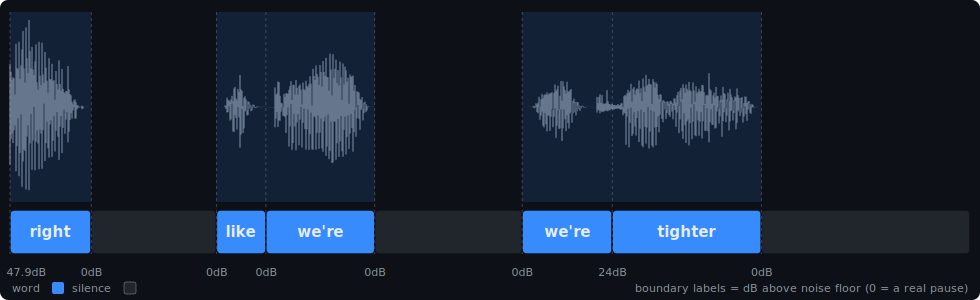

# transcript-tiler



*Above: [`samples/sample.wav`](samples/) tiled — the stutter's first "we're" and the
filler "like" both end at a 0 dB boundary (cuttable); "we're→tighter" is embedded
at 24 dB. Regenerate with `uv run python samples/render.py samples/sample.wav
samples/sample.labels.json docs/sample-labeling.svg`.*

**Work in progress.** Refine the sloppy word timestamps from your
speech-to-text tool into a gap-free **word | silence | noise tiling** of the
audio — using energy, silero VAD, and spectral flatness only. No forced
alignment, no re-transcription. Being developed and tested against
[CoRecursive](https://corecursive.com) podcast audio; expect rough edges
elsewhere (ungated audio in particular is untested — see below).

Every instant of the track gets exactly one label; boundaries are shared
transitions (a word's end *is* the next label's start). Each word also carries
**edge freedom**: whether each side borders a real pause (`startKind`/`endKind`)
and how deeply the signal dips to the noise floor there (`startDb`/`endDb`,
0 dB = a true pause) — so downstream tools can decide which words are safely
cuttable.

On a small hand-labeled golden set from that audio (14 clips), this approach
scored 0 gross / 0 severe boundary errors (p90 44 ms) where raw STT marks and
forced aligners (MMS/wav2vec2, WhisperX) sat at 7–10 gross errors per set —
promising, but not yet validated beyond that corpus.

This is an extraction: the algorithm comes from a larger private
podcast-production toolchain, where it drives programmatic edits. The
hand-labeling UI, golden clips, and eval harness that produced the numbers
above still live there — so those results aren't reproducible from this repo
yet. Extracting the eval is the plan; until then, treat the numbers as the
author's measurements, not a benchmark you can rerun.

## Install

```bash
git clone https://github.com/adamgordonbell/transcript-tiler
cd transcript-tiler
uv sync            # or: pip install .
```

Heads up: silero VAD pulls in torch, so the first sync downloads a large
dependency. Not on PyPI yet.

## Recipe: transcript → cuttable filler list

```bash
# 0. get a word-timestamped transcript (any of Whisper/WhisperX/generic)
whisper track.wav --model medium --word_timestamps True --output_format json

# 1. build the labeling (corrected word boundaries + edge freedom)
uv run transcript-tiler tile track.wav track.json                  # → track.labels.json

# 2. calibrate for YOUR audio: see the noise floor + edge-dB distribution
uv run transcript-tiler stats track.labels.json

# 3. emit the words free enough to cut
uv run transcript-tiler stops track.labels.json --only um,uh                # clean both sides
uv run transcript-tiler stops track.labels.json --only um,uh --seam-db 10   # + one-sided cuts
```

There is no separate "measure the silence level" step — the noise floor is
self-estimated per chunk (20th-percentile fine RMS × 1.5) and every
`startDb`/`endDb` in the output is *relative to it* (0 dB = at the floor).
The estimated floor is reported in the output (`"floors"`, dBFS) and by
`stats`, so you can sanity-check it.

**Gated vs ungated audio.** On gated tracks (edges pumped to digital zero)
the floor sits at the gate residue (~−77 dBFS) and free edges score exactly
0 dB — the distribution is sharply bimodal and the defaults just work. On
ungated audio the floor lands on your room tone and free-edge dBs will sit a
little above 0. Run `stats` first: healthy audio shows pause-adjacent edges
clustered near 0 dB and word-abutting edges ≫ (median ~30); set `--max-db`
just above the pause-edge p95 (the `stats` output suggests a value).

Other outputs:

```bash
uv run transcript-tiler tile clip.wav clip.json --format textgrid  # → Praat/ELAN interop
uv run transcript-tiler tile clip.wav clip.json --format audacity  # → Audacity label track
```

Scales to multi-hour files (chunked partial decode, split at silences) and
caches by content hash — re-runs on unchanged input are instant.

### Input formats (auto-detected)

| format | shape |
|---|---|
| `whisper` | `{"segments":[{"words":[{"word","start","end"}]}]}` — `whisper --word_timestamps True` |
| `whisperx` | same, or the flat `"word_segments"` list |
| `generic` | `{"words":[{"w"\|"word", "t"\|"start", "e"\|"end"}]}` |

### Output (native JSON)

```json
{
  "labels": [
    {"kind": "silence", "w": "",     "start": 0.0,  "end": 6.32},
    {"kind": "word",    "w": "Yeah", "start": 6.32, "end": 6.565,
     "startKind": "silence", "endKind": "word", "startDb": 0.0, "endDb": 34.1}
  ],
  "words": ["…derived view…"], "silences": [], "noise": []
}
```

`labels` is the source of truth — a complete ordered cover. `--format textgrid`
exports the tiling for Praat/ELAN/MFA comparison (edge freedom is JSON-only;
no standard slot for it).

## Actually cutting the words (ffmpeg)

To be clear about what gets removed: **only the flagged word spans** from the
`stops` output. The silence around each word is untouched — no silence
trimming, no pause compression. Removing the words cleanly is three ideas:

1. **Keep segments, don't cut segments** — invert the cut spans into a keep
   list and rebuild the file from those.
2. **Butt joints are already clean** — every cut face sits at the noise floor
   (that's precisely what the dB check verified), so the seam is
   silence-to-silence.
3. **Micro-fade as insurance** — a ~5 ms `afade` in/out on each keep segment
   face guards against dither/DC ticks. Not a crossfade; the segments don't
   overlap.

One consequence to know: the pause the word sat in survives the cut, and the
silences on either side of it join into one — so the pause gets *longer* by
the word's duration. Fine for a rough cut; if pacing matters, follow with a
silence-shortening pass (a natural fit for the `silences` list in the
labeling, but not built here yet).

[`samples/cut.py`](samples/cut.py) does exactly this with one ffmpeg
`filter_complex` (atrim → afade in/out → concat):

```bash
uv run transcript-tiler stops track.labels.json --only um,uh -o cuts.json
uv run python samples/cut.py track.wav cuts.json trimmed.wav
```

If you'd rather review before cutting, `--format audacity` gives you the same
spans as an importable label track.

## Samples

[`samples/`](samples/) has the full round-trip on a 2.6 s clip:
`sample.wav` + `sample.json` (input words) → `sample.labels.json` (the tiling
above) → `sample.stops.json` (the two one-sided hits). Plus `render.py` (the
header image) and `cut.py` (the ffmpeg remover).

## Library

```python
from transcript_tiler.adapters import load_transcript
from transcript_tiler.tile import enrich
from transcript_tiler.stops import free_words

labeling = enrich("clip.wav", load_transcript("clip.whisper.json"))
cuttable = free_words(labeling, only=["um", "uh"], seam_db=10)
# each hit: {"w", "start", "end", "category": "free"|"one-sided", "freeSide", ...}
```

## How it works

1. **Coarse tiling** (10 ms grid): silero VAD + RMS + spectral flatness →
   3-class frames; merged speech segments split into per-segment energy
   *bursts* (threshold relative to each segment's own peak); words matched to
   bursts monotonically by centre. Gaps become silence, or noise where
   non-speech (breath/click) frames dominate.
2. **Edge refinement** (5 ms grid): word↔gap edges walk out to the noise
   floor, capturing soft attacks/releases the coarse threshold cuts short —
   with a fricative-aware jump so a trailing /s/ after a stop closure stays
   part of its word.
3. **Edge freedom**: each word boundary is annotated with its neighbour kind
   and the floor-margin dB of the quietest point near the boundary.
